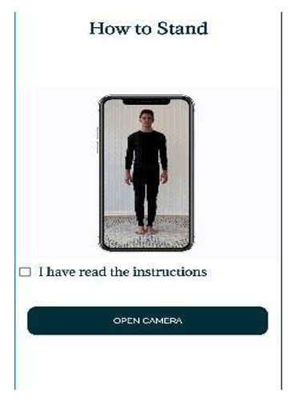
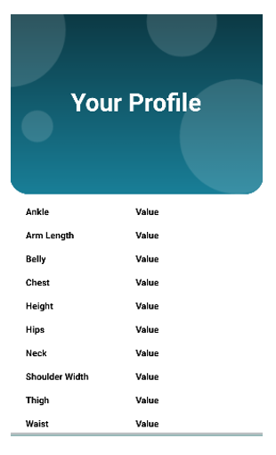

# AI_Tailor-Human-Body-Measurement-
## Overview
This Human Body Measurement program is designed to automate the process of obtaining precise body measurements from images. The program utilizes a combination of advanced machine learning models and image processing techniques. The workflow involves three main steps:

## Image Segmentation:
Uses DeepLabV3, a state-of-the-art semantic segmentation model powered by TensorFlow, to segment human figures from the background.
## 3D Body Construction:
Employs Human Mesh Recovery (HMR) to construct a 3D model of the human body from the segmented images.
## Measurement Extraction: 
Applies custom algorithms on the 3D model to calculate body measurements accurately.
This approach ensures that the measurements are not only automated but also accurate, catering to various applications such as tailored clothing, health monitoring, and virtual fitting rooms.
# Project Structure
The project is organized into the following main directories and files:

segmentation/: Contains the TensorFlow implementation for the DeepLabV3 model.
hmr/: Includes the HMR model setup for 3D body construction.
measurements/: Scripts to extract measurements from the 3D models.
src/: Utilities and configurations for model operations.
RunModel.py: A script that integrates the HMR model into the workflow.
main.py: The main script that orchestrates the segmentation, 3D construction, and measurement extraction.

# Pre-trained Models:
[Body_Segmentation(DeepLabV3)](https://drive.google.com/drive/folders/1SNrbsXGBQuWTUebUmPMAerbsa1mKsjZB?usp=drive_link)

[3D constrcution](https://drive.google.com/drive/folders/1VTr73CjZs5wEYrGgWJpeduQ5-cxmvtGj?usp=drive_link)

# Mobile Application interface:
The front page of the AI Tailor app features a visually engaging and dynamic element where the AI Tailor logo gracefully slides from the lower part of the screen to the upper part. This animation adds an element of movement and interactivity to the app's user interface, enhancing the overall user experience.

The initial page of our mobile application serves as a user profile setup, aiming to collect essential information for calculating body measurements. This section requires users to input their height, weight, gender, and waist measurements. The gathered data will be utilized to generate accurate and personalized body measurements, facilitating the app's functionalities and enhancing the user experience.

Once the user agrees to the instructions, the camera function of the app will be opened, allowing the user to take a picture.

The last page of the mobile application will display the measurements of the user on the screen.

# Acknowledgments
[HMR](https://github.com/akanazawa/hmr?tab=readme-ov-file)

[Body_Measurements](Human-Body-Measurements-using-Computer-Vision)

